# Writeup for 6 Linux challenges in training week2

## Challenge 1
- Link: https://tryhackme.com/module/linux-fundamentals
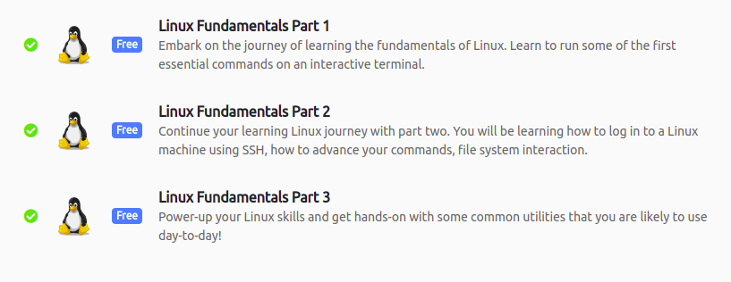

## Challenge 2
- Link: https://overthewire.org/wargames/bandit
- Yêu cầu: Giải mỗi challenge chỉ trong vòng 1 dòng command và filter kết quả trong output.
### 1. Level 0 - Level 1:
```sh
sshpass -p bandit0 ssh bandit0@bandit.labs.overthewire.org -p 2220
cat readme
```
### 2. Level 1 - Level 2:
```sh
sshpass -p boJ9jbbUNNfktd78OOpsqOltutMc3MY1 ssh bandit1@bandit.labs.overthewire.org -p 2220
cat ./-
```
### 3. Level 2 - Level 3:
```sh
sshpass -sshpass -p CV1DtqXWVFXTvM2F0k09SHz0YwRINYA9 ssh bandit2@bandit.labs.overthewire.org -p 2220
cat *
```
### 4. Level 3 - Level 4:
```sh
sshpass -p UmHadQclWmgdLOKQ3YNgjWxGoRMb5luK ssh bandit3@bandit.labs.overthewire.org -p 2220
cat inhere/.hidden
```
### 5. Level 4 - Level 5:
```sh
sshpass -p pIwrPrtPN36QITSp3EQaw936yaFoFgAB ssh bandit4@bandit.labs.overthewire.org -p 2220
file ./inhere/* | grep -v "data" | cut -d ":" -f1 | xargs cat
```
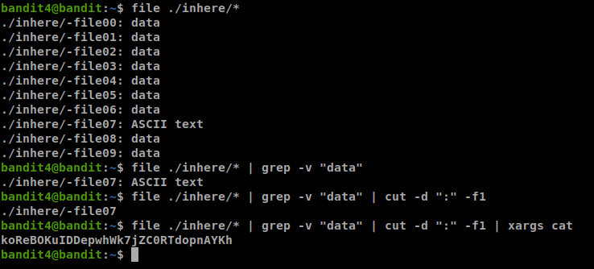
### 6. Level 5 - Level 6:
```sh
sshpass -p koReBOKuIDDepwhWk7jZC0RTdopnAYKh ssh bandit5@bandit.labs.overthewire.org -p 2220
find . -type f -readable -size 1033c | xargs cat | tr -d " \t\r"
```
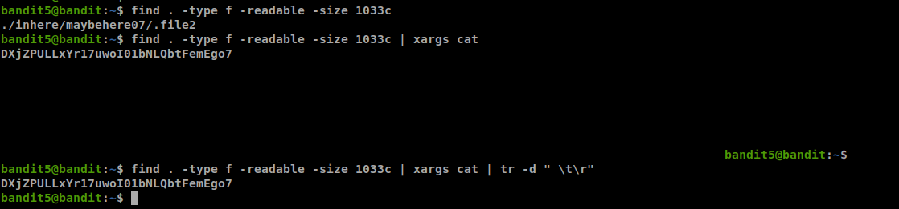
### 7. Level 6 - Level 7:
```sh
sshpass -p DXjZPULLxYr17uwoI01bNLQbtFemEgo7 ssh bandit6@bandit.labs.overthewire.org -p 2220
find / -size 33c -user bandit7 -group bandit6  2> /dev/null | xargs cat
```
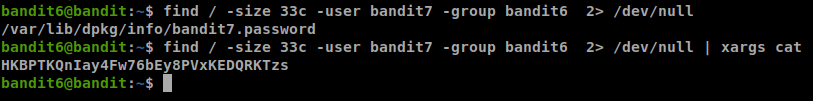
### 8. Level 7 - Level 8:
```sh
sshpass -p HKBPTKQnIay4Fw76bEy8PVxKEDQRKTzs ssh bandit7@bandit.labs.overthewire.org -p 2220
cat data.txt | grep millionth | cut -f2
```
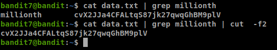
### 9. Level 8 - Level 9:
```sh
sshpass -p cvX2JJa4CFALtqS87jk27qwqGhBM9plV ssh bandit8@bandit.labs.overthewire.org -p 2220
sort data.txt | uniq -u
```
### 10. Level 9 - Level 10:
```sh
sshpass -p UsvVyFSfZZWbi6wgC7dAFyFuR6jQQUhR ssh bandit9@bandit.labs.overthewire.org -p 2220
strings data.txt | grep -E "= [a-zA-Z0-9]" | tail -n1 | cut -d " " -f2
```
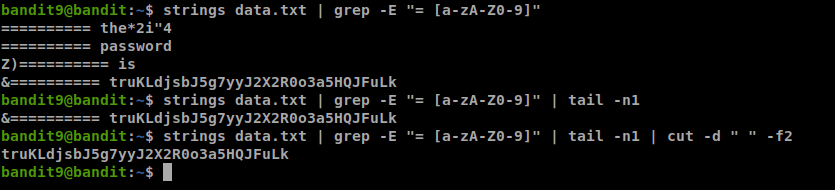
### 11. Level 10 - Level 11:
```sh
sshpass -p truKLdjsbJ5g7yyJ2X2R0o3a5HQJFuLk ssh bandit10@bandit.labs.overthewire.org -p 2220
base64 -d data.txt | cut -d " " -f4
```
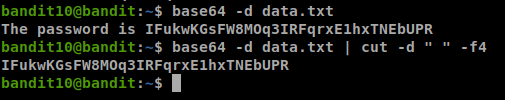
### 12. Level 11 - Level 12:
```sh
sshpass -p IFukwKGsFW8MOq3IRFqrxE1hxTNEbUPR ssh bandit11@bandit.labs.overthewire.org -p 2220
cat data.txt | tr "a-zA-Z" "n-za-mN-ZA-M" | cut -d " " -f4
```
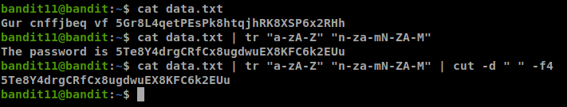
### 13. Level 12 - Level 13:
```sh
sshpass -p 5Te8Y4drgCRfCx8ugdwuEX8KFC6k2EUu ssh bandit12@bandit.labs.overthewire.org -p 2220
xxd -r data.txt | gzip -d | bzip2 -d | gzip -d | tar -xO | tar -xO | bzip2 -d | tar -xO | gzip -d | cut -d " " -f 4
```
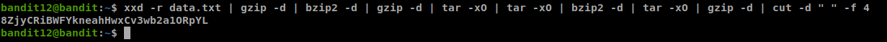
### 14. Level 13 - Level 14:
```sh
sshpass -p 8ZjyCRiBWFYkneahHwxCv3wb2a1ORpYL ssh bandit13@bandit.labs.overthewire.org -p 2220
ssh -o "StrictHostKeyChecking=no" -i sshkey.private bandit14@localhost cat /etc/bandit_pass/bandit14 2>/dev/null
```
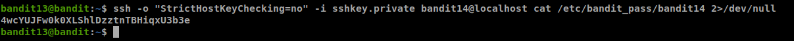
### 15. Level 14 - Level 15:
```sh
sshpass -p 4wcYUJFw0k0XLShlDzztnTBHiqxU3b3e ssh bandit14@bandit.labs.overthewire.org -p 2220
cat /etc/bandit_pass/bandit14 | nc localhost 30000 | grep -n 2 | cut -d ":" -f2
```
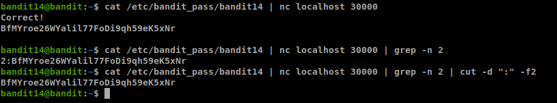

## Challenge 3
- Link: sshpass -p "password123" ssh chall@167.172.68.241 -p2001
### Phân tích
- Sau khi login vào server, với 1 số thao tác cơ bản ta phát hiện tại thư mục chúng ta đang đứng có 2 file **run.sh** và **mywork.py**.
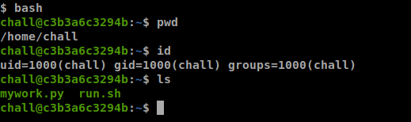
- Sau khi đọc nội dung 2 file này ta biết được file **run.sh** sẽ chạy file **mywork.py** (với chế độ background), sleep 2s và sẽ xóa file **/tmp/flag.txt**.
    ```sh
    #! /bin/sh
    
    /usr/bin/python3 /home/chall/mywork.py &
    sleep 2
    /usr/bin/rm -f /tmp/flag.txt
    ```
- Còn trong file **mywork.py**, chương trình sẽ mở file **/tmp/flag.txt**, sleep 9999999s (tầm 3 tháng), sau khi sleep xong sẽ đóng file  **/tmp/flag.txt**.
    ```python
    #!/usr/bin/python
    
    import time
    import os
    
    f = open('/tmp/flag.txt', 'r')
    flag = f.read()
    
    time.sleep(9999999)
    f.close()
    ```
- Ở đây ta có thể nhận thấy flag rất có thể nằm trong file **/tmp/flag.txt**, tuy nhiên nếu hệ thống chạy file **run.sh** thì sau khi chạy xong file **run.sh** này thì file **/tmp/flag.txt** cũng sẽ bị xóa ---> **file bị xóa trong linux** ????


### Some background 
- Trước kia (ngay cả khi lúc mình ra cái đề này) mình nghĩ là với mỗi 1 file trong hệ thống linux thì nội dung của file đó sẽ được lưu trong 1 vùng nhớ nào đó trong ổ cứng và tên file bằng 1 cách nào đó sẽ được trỏ đến vùng nhớ này. Và lúc mình xóa file (bằng rm chứ không phải move vào Trash đâu nha mấy cha :vv) thì vùng nhớ đó cũng sẽ được giải phóng (free). Tuy nhiên sự thật không phải đơn giản như vậy.
- Linux có 1 khái niệm là **I-node** hay là **index node**, nó là 1 cái structure để lưu: file size, permission, ...,  **link** và 1 cái con trỏ để trỏ đến vùng nhớ lưu data thật sự. Có thể hiểu đơn giản **I-node** là thèn đứng giữa **filename** (mà chúng ta thường thao tác) với **file content** (được lưu trong phần cứng). Và với mỗi **I-node** thì có thể được link đến bởi nhiều **filename**. 
- Để hiểu rõ hơn về **I-node** mình xin lấy 1 ví dụ như hình dưới. Lúc đầu mình dùng **ls -li** thì ngoài việc hắn liệt kê được 1 file với dung lượng 3.2GB, thì hắn còn hiển thị 1 con số **I-node** **25328**. Lúc này **file1** đang trỏ đến cái **I-node** này. Tiếp theo là 2 dòng lệnh liên kết cứng (hard link) để tạo ra 2 file **file2** và **file3**. Đến dòng lệnh thứ 4 (**ls-li**) nếu các bạn chưa biết về **I-node** thì sẽ nghĩ rằng trong thư mục này sẽ có 3 file và tốn dung lượng hết 9.6GB. Nhưng thưc tế không phải, 3 file này đều trỏ đến cùng 1 **I-node 25328**, và cái **I-node** này sẽ chứa 1 con trỏ trỏ đến vùng nhớ chứa 3.2GB dữ liệu kia, do đó hiện tại thư mục này vẫn chỉ chiếm 3.2GB bộ nhớ thôi. Câu lệnh tiếp theo là **stat file1**, ở câu lệnh ta chỉ cần chú ý 2 thứ: **I-node** thì ta đã biết rồi, cái thứ 2 là **link**. **Số lượng link** sẽ đại diện cho số lượng file đang liên kết đến cái **I-node** này. 2 dòng lệnh tiếp theo là **echo** và **ls -li**, cái này dùng để chứng minh 3 file này chung quy lại đều trỏ đến 1 vùng nhớ vì khi 1 file tăng dung lượng thì 2 file kia cũng sẽ tự động tăng theo. Tiếp theo là câu lệnh **rm file1**, sau khi xóa **file1** thì 2 file kia vẫn còn, và quan trọng hơn là **I-node** vẫn còn, do đó vùng nhớ 32GB này vẫn chưa bị xóa. Ở câu lệnh **stat file2** các bạn sẽ thấy **link=2** vì lúc này chỉ còn 2 file liên kết đến **I-node 25328**. Vậy câu hỏi đặt ra là đến khi nào vùng nhớ 3.2GB này mới bị xóa ??? Để xóa được vùng nhớ 3.2GB này thì phải thỏa 2 điều kiện: 1 là số lượng **link** bằng **0** (check bằng **stat** command), có nghĩa là nếu chúng ta xóa hết các file link đến cái **I-node** này thì vùng nhớ 3.2GB có thể được xóa - nếu thỏa mãn thêm điều kiện 2. .... Do đó như mình đã nói trước đó, khi xóa 1 file thì thật ra chỉ là **unlink** cái **filename** với cái **I-node** thôi, chứ nội dung file chưa chắc đã bị xóa. 
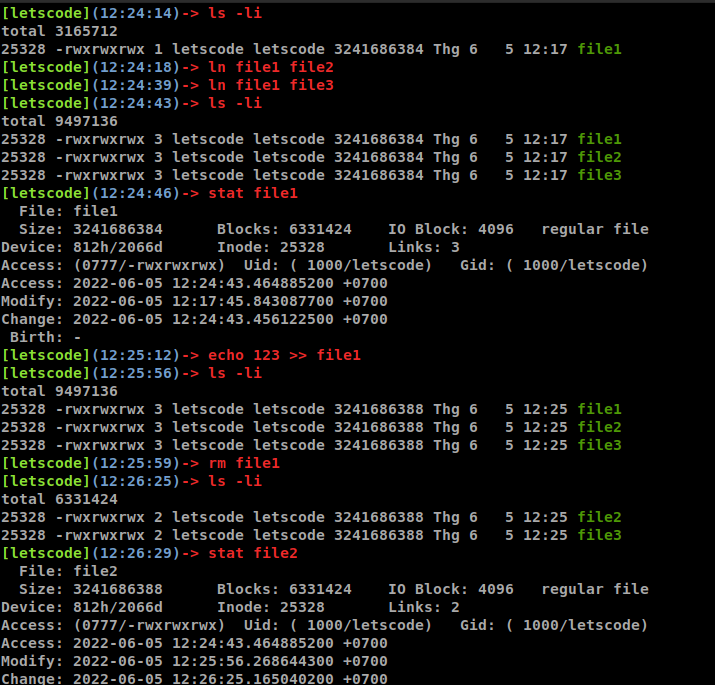
- OK đến điều kiện thứ 2 để xóa được vùng nhớ 3.2GB này. Nếu file này đang được mở trong bất kỳ 1 process nào và chưa bị đóng thì dù sau đó có xóa hết tất cả các filename link đến **I-node** thì **I-node** đó vẫn sẽ còn sống và chỉ bị xóa khi process đang mở file đó chết hoặc process đó đóng file đó lại. Chung quy lại, vùng nhớ nội dung của 1 file lưu trong ổ cứng chỉ bị free khi không có filename nào link đến **I-node** của vùng nhớ đó và không có process nào đang mở file được liên kết với **I-node** đó. Để liệt kê tất cả các file đang mở trong hệ thống các bạn có thể sử dụng lệnh **lsof** (list open file), hoặc các bạn có thể vào cụ thể 1 process và check trong thư mục **/proc/{PID}/fd**, tất nhiên trong thư mục này mặc định sẽ có 3 file **0, 1, 2** lần lượt đại diện cho **stdin, stdout, stderr**, nếu trong  process các bạn mở 1 file nào đó thì nó sẽ hiển file **3** và cứ thế tăng lên nếu không có file nào bị đóng. Nói chung cái điều kiện 2 này nó còn nhiều cái khác nữa nếu muốn hiểu sâu, các bạn có thể tham khảo thêm từ [cuốn sách này](https://man7.org/tlpi/).

### Quay lại challenge
- Sau khi vào đọc code 2 file thì ta cũng có thể hiểu hệ thống chạy file **run.sh**. Nếu không chắn chắn thì **ps aux** để lôi cái process đầu tiên ra thì biết hắn chạy chương trình **supervisor**, search google 1 tí sẽ ra đường dẫn file configure của chương trình này là ở **/etc/supervisor/conf.d/supervisord.conf**, đọc thêm 1 tí thì sẽ biết process 1 này sẽ chạy file **run.sh**. Thôi đoạn này mấy ông cứ hiểu code rồi  mặc định hệ thống chạy file **run.sh** đi, bao giờ bí quá mới mò sâu lên cái process đầu tiên.
- Có thêm 1 điểm đáng chú ý nữa là trong file **run.sh**, vì hắn chạy file **mywork.py** ở chế độ **background** nên cái dòng xóa file flag.txt vẫn sẽ được chạy dù cho chương trình python chưa chạy xong.
- Lúc này ta nhận thấy file **flag.txt** đã bị xóa (đúng hơn là đã bị unlink) nhưng vẫn còn 1 process đang mở file **flag.txt** và file **flag.txt** vẫn chưa bị đóng trong process đó. Vậy là **I-node** cũng như nội dung của file **flag.txt** vẫn còn trong ổ cứng và vẫn có thể truy cập thông qua **/proc/10/fd/3**. Cái **PID 10** kia có thể tìm thấy thông qua câu lệnh **ps aux** để tìm **PID** của chương trình python đang chạy, còn file có tên là **3** thì chắc chắn rồi vì code python không xóa file nào trước hay sau khi mở file **flag.txt**, và chỉ mở 1 file **flag.txt** (đoạn này để chắc chắn cứ kiếm tra thư mục **/proc/{PID}/fd** rồi **ls -l** để biết nó link đến file nào).  
- Sau khi đã lấy được flag thì ae có thể decode ROT13 để lấy flag cuối cùng. 
- P/s: vì mình build challenge này dựa trên ý tưởng của 1 bài writeup khác nên lúc đó mình chưa biết đến kiến thức sâu xa này, nên nội dung của flag không được khớp lắm. Tuy nhiên vẫn có thể sẽ đúng bởi vì trong code python ở file **mywork.py** có 1 dòng **flag = f.read()** nên nội dung file flag cũng đã được load vào bộ nhớ RAM, chỉ tiếc là mình không đọc được file **mem** hay file **stack**, nếu đọc được thì nội dung của flag lại ok :vv

### Khai thác challenge này
- Trên hệ thống server này tác gỉả đã cấu hình permission cho các file **.profile**, **.bashrc** không đúng, cho phép user sau khi login vào hệ thống có thể sửa đổi các file này. Mình sẽ giới thiệu 2 trường hợp có thể khai thác từ lỗ hổng này.
    + Phương án 1: 1 người chơi nào đó có thể chèn đoạn code sau vào trong file **.profile** nhằm để logout toàn bộ người chơi đăng nhập vào server với IP không thuộc IP cho phép. Tuy nhiên cách này thì cũng đơn giản mà lại quá lộ liễu, người chơi có thể dễ dàng thay đổi lại file **.profile** từ bên ngoài mà không cần login thao tác với server từ bên trong.
        ```sh
        #! /bin/sh
        white_ip='117.2.164.216'
        login_ip=`echo $SSH_CONNECTION | cut -d " " -f1`
        if [ "$white_ip" != "$login_ip" ] ; then
            exit 0
        fi
        ```
    + Phương án 2 (ý tưởng của phương án này là từ bạn Nguyễn Đức Nghĩa k19): Đó là lưu lại tất cả command từ những người chơi khác vào 1 file log, và nếu 1 ai đó giải ra thì command sử dụng cũng như flag sẽ được lưu lại trong file log đó, người chơi đó chỉ việc check log để lấy flag cũng như solution. Để làm được điều này thì trên hệ thống Linux có 1 câu lệnh **script** dùng để lưu lại lịch sử command cũng như kết quả của command của người dùng. Vì file **.profile** có quyền ghi, mà bất kỳ ai sau khi login vào server, hệ thống sẽ auto chạy file **.profile** này, do đó giống như phương án 1, ta sẽ chèn đoạn code sau vào trong file **.profile**. Với đoạn code này thì mọi thao tác cũng như kết quả command của người chơi sẽ được lưu hết tại file **/dev/shm/admin_log**.
        ```sh
        echo 'exec script -a -f -q -c /bin/sh /dev/shm/admin_log' >> /home/chall/.profile
        ```

## Challenge 4
- Link: nc 167.172.68.241 2002
### Solution:
- Với mô tả của challenge: flag được chia làm 3 phần và đang được lưu trong 1 process nào đó. Thì chúng ta có thể tìm kiếm trong chính process này xem sao.
- Đầu tiên chúng ta có thể tìm kiếm tên của chương trình cũng như cách chương trình này được chạy bằng cách mở file **/proc/self/cmdline**

    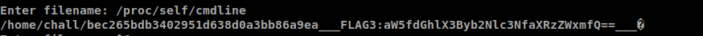
- Ở đây ta có thể nhận thấy 2 vấn đề. 
    + Ta nhận thấy có chuỗi **FLAG3** và bằng tâm linh ta có thể cảm nhận nó đã bị encode bằng **base64**. Sau khi decode ta được 1 mảnh của flag. 

        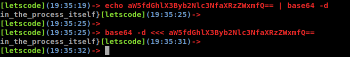
    + Cách chương trình được chạy: rất có khả năng **/home/chall/bec265bdb3402951d638d0a3bb86a9ea** là file thực thi, còn **___FLAG3:aW5fdGhlX3Byb2Nlc3NfaXRzZWxmfQ==\_\_\_** là 1 tham số khi chương trình này được chạy. Khi đó để chắc chắn ta có thể kiểm tra ở file **/proc/self/maps**.

        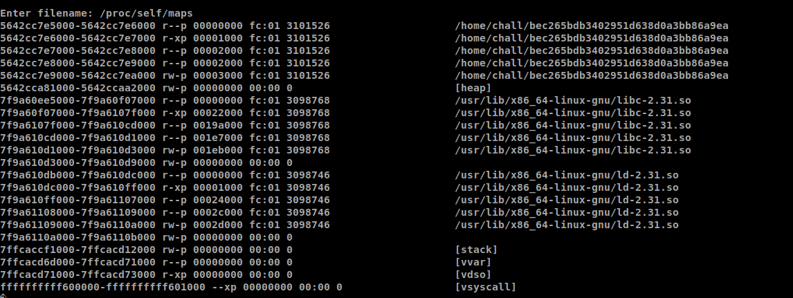
    + Lúc này ta có thể thử đọc file thực thi bằng cách đọc file **/home/chall/bec265bdb3402951d638d0a3bb86a9ea** hoặc file **/proc/self/exe**... Và chúng ta có được mảnh thứ 2 của flag.

        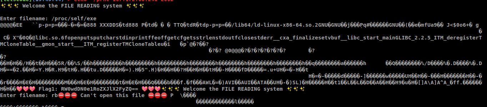
- Cuối cùng bằng biện pháp tâm linh hoặc nhờ hint của tác giả, chúng ta biết được mảnh flag cuối cùng của flag sẽ được **export** vào trong 1 biến môi trường và được loaded vào process khi chương trình chạy. Để kiểm tra danh sách biến môi trường của 1 process ta có thể kiểm tra ở file **/proc/self/environ** ... Và chúng ta có được mảnh flag cuối cùng.
 
    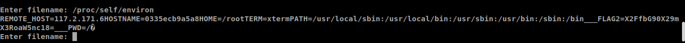
- Và đây là flag của challenge: Em0t3t{There_are_a_lot_of_things_in_the_process_itself}

## Challenge 5
- Link: nc 167.172.68.241 2003
### Phân tích challenge
- Sau khi truy cập challenge, ta có thể nhận ra ngay ta đang đứng trong 1 hệ thống linux nào đấy và còn được phép thực thi lệnh. Tuy nhiên đa phần các command đều bị lỗi và không thực thi được, thông qua thông tin lỗi xuất ra màn hình thì ta biết được chúng ta đang sử dụng **rbash** shell, chứ không phải **bash** hay **dash** mà chúng ta thường sử dụng. Để hiểu hơn về **rbash** shell, các bạn có thể tham khảo bằng cách **man rbash**.

    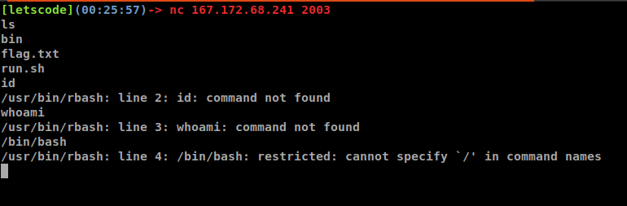
- Có 1 hạn chế rất đặc trưng ở **rbash** shell đó là chúng ta không được phép có kí tự **/** trong tên của command. Ví dụ gõ **/bin/ls -la** sẽ bị lỗi. 
- Tiếp theo vì 1 số lệnh thông dụng đều bị lỗi **command not found** nên khả năng cao biến môi trường **PATH** cũng đã bị chỉnh sửa, không còn lưu các giá trị như **/bin** hay **/usr/bin** như mặc định nữa.

    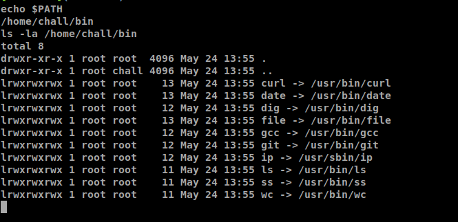
- Sau khi kiểm tra thì ta thấy biến môi trường **PATH** đang lưu giá trị **/home/chall/bin**, điều đó có nghĩa là ta chỉ có thể thực thi được các command được lưu trong thư mục này thôi (really ????).
- Thật ra thì không hẳn, trong hệ thống linux, ngoài các command được lưu trong các file **bin** thì vẫn còn các **builtin command** (các bạn có thể gõ **help** để xem các command đó). Cơ mà quay lại challenge, vì chúng ta đang ở trong **rbash** shell nên chúng ta cũng không thể sửa lại biến môi trường **PATH** như bình thường được.
### Solution
- Vì trong thư mục **/home/chall/bin** có file **ls** nên ta dễ dàng biết được trong thư mục hiện tại có 1 file **flag.txt**, việc còn lại chỉ là đọc file này thôi. Để đọc được file này thì có 2 hướng: 1 là sử dụng các **builtin command** (cái này mình để dành đến challenge sau sẽ trình bày luôn), 2 là sử dụng 10 command tác giả cho trong thử mục **/home/chall/bin**.
    + wc --files0-from flag.txt
    + curl file:///home/chall/flag.txt
    + date -f flag.txt
    + dig -f flag.txt
    + file -f flag.txt
    + gcc -x c -E flag.txt
    + git diff /dev/null flag.txt
    + ip -force -batch flag.txt
    + ss -a -F flag.txt
    + . ls \`\<flag.txt\` hoặc ls $(\<flag.txt) (**ls** chỉ làm màu thôi, chứ như này cũng xong game rồi **$(\<flag.txt)** :vv)

### Advanced - thoát khỏi rbash

- Có thể có ae thắc mắc ủa 9 cái command đầu tiên ở đâu mà sao có thể đọc được file hay vậy, thì thứ nhất 9 command đó là 9 command rất thông dụng, thứ 2 về chức năng đọc file của các command này thì tác giả cũng đã được tham khảo từ [link này](https://gtfobins.github.io/).
- Tiếp tục, có thể sẽ có nhiều ae tìm kiếm về các bài writeup về việc thoát khỏi **rbash** shell như challenge này. Và trong các bài viết đó có bài sẽ đề cập đến cách dùng **vim**, **python**, ... để chúng ta tận dụng những command này để lấy 1 cái shell khác (bash/dash/..) nhưng những writeup này chỉ đề cập 1 vài cách cụ thể cho 1 vài command nào đó chứ không tổng quát, ví dụ như trường hợp challenge này sẽ không có **vim** hay **python** để sài. Mình thì chỉ share thôi chứ mấy cái này cũng "ao trình" mình mà - vâng chính là cái [link khi nãy](https://gtfobins.github.io/).  Dựa vào cái document này thì ta biết trong 10 command tác giả cho có 2 command cho phép chúng ta lấy được cái shell mới, đó là **gcc** và **git**.
    + gcc -wrapper /bin/bash,-s .
    + git trong trường hợp này không sử dụng được vì thiếu 1 số command cần thiết.
- Sau khi sử dụng câu lệnh **gcc** ở trên, ta sẽ có cái shell **/bin/bash**, lúc này chúng ta có thể thay đổi được biến môi trường **PATH** để sử dụng như bình thường mà không còn bị giới hạn như trước nữa.

    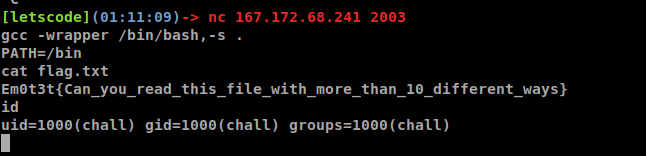

## Challenge 6
- Link: nc 167.172.68.241 2004
### Phân tích challenge
- Challenge này tương đối giống challenge trước ngoại trừ 2 điểm:
    + Sẽ không có 10 command được tặng như challenge trước
    + Flag bị chia ra 3 phần:
        + Phần 1: Tên của 1 file 
        + Phần 2: Nội dung của 1 file với tên file có dạng xxxx.txt
        + Phần 3: Nội dung của 1 file với tên file không xác định
### Solution
- Đầu tiên mình xin liệt kê 1 số cách đọc file bằng các **builtin command** như:
    + . filename hoặc source filename (được nhưng không khuyến khích)
    + echo \$(\<filename) thay vì \$(\<filename) (chỉ đẹp nếu file 1 line)
    + while read line; do echo $line; done < filename (chuẩn rồi)
    + maybe more
- Ở challenge này có 3 file và ta đều không biết tên của 3 file này. Tuy nhiên tác giả có gợi ý có 1 file có dạng xxxx.txt. Do đó ta có thể sử dụng ký tự **?** để thay thế cho các ký tự mà chúng ta không biết. Cụ thể là:
    ```sh
    echo `<????.txt`
    ```

    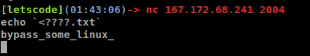

- Sau khi đã có được 1 mảnh flag, tiếp theo chúng ta cần phải liệt kê được tên của 2 file còn lại.
- Bằng 1 cách tình cờ ta biết command **cat \*** sẽ in ra nội dụng của tất cả các file (trừ hidden file) và error (nếu là thư mục). Và nếu dùng command **cat f1 f2 d1 d2** thì cũng ra kết quả tương tự -> có khi nào **\* = f1 f2 d1 d2**, do đó chúng ta có thể sử dụng **echo \*** vì biết đâu hắn có thể thay thế được cho **ls** và kết quả:

    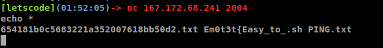
- Nâng cao hơn 1 tí thì **echo** có thể thay thế được cho chức năng chính của **ls**

    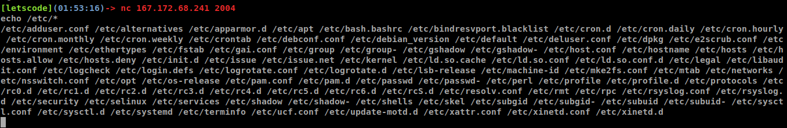
- Sau khi đã có được tên 2 file còn lại thì chũng ta đã có mảnh 2 của flag, tiếp tục sử dụng **echo** để đọc file chứa mảnh thứ 3 của flag.
- Flag cuối cùng sẽ là: Em0t3t{Easy_to_bypass_some_linux_restricted_rules}